# Tutor U

## Site Overview
The Tutor U site in part provides advertisement and information for a free, voluntary tutor based, online, on-demand tutoring scheme operated by a non-profit organisation. The tutoring is offered in core STEM subjects to secondary school and sixth form college students, and voluntary tutors register to tutor as often as they like each week, and provide arranged one hour video call sessions with a student seeking help in a core STEM subject. 

Additionally the site provides the means by which potential voluntary tutors apply to become a tutor and they can provide the days and times during a week they wish to tutor, and in what subjects. The site also provides the ability for students to book a session with an available tutor and specify the topic and or problem they would like to discuss in advance. The site currently only uses HTML and CSS.
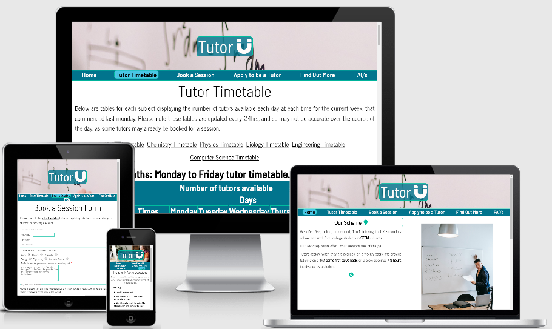

## Design Process
This section details the initial planning and design performed before the site was constructed. Some of the initial design decisions were modified in the current site state.

### Strategy

#### Target Audience:
The primary audiences are firstly secondary school and sixth form college students in the UK seeking tutoring in STEM subjects; and secondly individuals looking to become voluntary tutors in STEM subjects. It is anticipated that the bulk of said tutors will be undergraduates studying a STEM degree who are seeking voluntary tutor roles, for the sake of their CV development through gaining skills and experience. Students with a possible interest in teaching will also have a strong desire to seek experience. The other group of volunteers are anticipated to be retired teachers, or any other individuals who have sufficient expertise in a STEM subject, with an interest in helping students who would normally not have access to tutors, gain assistance in their learning.

#### User stories

##### Students:
- As a student, tutors are far too expensive for me, and there are very few schemes offering affordable tutoring. I wish there were more on demand affordable schemes I could use. 
- As a student tutoring is not accessible to me, there are no tutors nearby and I would have to travel which is not practical. I would like access to online tutoring
on a site that made booking a tutor very easy and stress free.
- As a student, if online tutoring were available through some site, I would want it to enable me to have the ability to specify my particular problem in advance in order to make a session worthwhile. I would also want the ability to have a range of times to pick from that fits my individual schedule.
- If a site existed that provided free online tutoring using voluntary tutors, I would want the site to have some way of ensuring voluntary tutors are sufficiently qualified.
- As a parent of a secondary school student I would like a site for organising online tutoring via a video call, to have a means of allowing tutors to provide enough 
information for safeguarding checks to be performed.

In summary potential student users desire affordable on-demand tutoring, that is easily accessible and thus online, tailored to them as individuals, and of good quality. A site should provide the ability for students to book a session on a topic of their choice with a qualified tutor with minimal effort.

##### Tutors:
- As an undergraduate I would like more opportunities to tutor in a STEM subject, in order to develop my CV.
- As an undergraduate considering a career in teaching, I would happily take part in a tutoring scheme for students in a STEM subject. It will allow me to gain a better insight in to what it entails. However I would want to tutor online in order to make it practical as I am often busy with my own studies attending lectures etc.
- As a postgraduate I would consider providing voluntary tutoring in maths and physics, but I would want the ability to choose how often and at what times I tutor, with the ability to stop when I want.
- As a professional working engineer, I would love the oppotunity to help the next generation with their studies and hopefully inspire them to become future engineers.
If a site existed that organised tutoring sessions, I would want it to be straightforward to apply to be a tutor. I would also want to only tutor in engineering, and so I would want to be able to specify this when applying through a site.
- As a retired teacher looking to keep busy, and still have the pleasure of teaching, I would want a site facilitating the organisation of online tutoring to be easy to use, and provide all the information I may need.

#### Site owners story:
Tutoring is generally expensive, in-practical and hard to access when tutoring is done in person, due to the lack of nearby tutors, and the need to travel for either the tutor or tutee; it also limits scalability. We are a non-profit organisation that after taking inspiration from existing tutoring schemes that seek to provide free tutoring in STEM subjects, want to create our own scheme, but make it more accessible. We aim to do this by hosting the tutoring online. A secondary desire for our organisation is to provide opportunities for volunteers to tutor. We require a website to facilitate and advertsie our scheme.

### Scope
#### Scheme scope:
The scope of the scheme will be to provide tutoring in any of the core STEM subjects to secondary school and college students within the UK, and to use voluntary tutors. 
The tutoring is to be hosted via a video call application that provides the ability to screen share. Volunteer tutors will apply to become a tutor and indicate on a weekly basis on what days and at what times they want to tutor. They will also need to indicate the STEM subjects they are qualified to tutor in. Tutoring sessions will be a maximum of one hour, and will be allocated on a first come first serve basis, up to one week in advance. Students wishing to be tutored will book a session at least 48hrs in advance. Additionally they will need to indicate with a short description the topic they would like their potential tutor to cover in their session.

#### Site key functions and content:
 In order to achieve the needs of the site owner and the users, as well as satisfy the websites purpose, it will minimally require the following functions and content:

- Provide advertisement of and information about the tutoring scheme
- A way for tutors to register their details, including their STEM subject expertise, as well as what dates and times during a week they will be available to tutor
- A way for students to book a tutoring session on a given date at a certain time, as well as enable them to provide a short description of the topic they would like to cover.
- A way to assist students with choosing which dates and times to request a session, and to have an idea of tutor availability.
- Content that answers any common questions tutors and students may have.

#### Proposed features:
To address the  minimal required site content and functionality, the following features were proposed to be implemented:
- Home/landing page to act as a clear concise summary introduction of the tutoring scheme and provide its key information. Also it will act as a first point of contact for tutees and tutors, to direct them to the necessary pages to allow them to apply to be a tutor and or arrange tutoring sessions. It will finally provide links to other pages explaining the full details of the scheme in more depth, and answering common questions.
- A form page for potential tutors to apply, where they can provide their personal details, including their STEM subject expertise, as well what dates and times during a week they want to tutor.
- A form page for tutees to book a tutoring session on a given date at a certain time, as well as enable them to provide a short description of the topic they would like to cover.
- To assist students in choosing which dates and times to book a session and enable them to have an idea of tutor availability, a  timetable page will be used that indicates at what times, on which dates, in which subjects how many tutors are available. This will be done for a rolling week.
- A further information page detailing the scheme in more depth, providing any important information not covered on the landing page.
- Finally a FAQ's page will be implemented to answer common questions of tutors and students.

### Structure/Skeleton

#### All pages
All pages will contain main navigation links near the top of the page to allow easy site navigation. All pages will contain a footer containing a social media links, contact, useful links and site map section. The site map will contain links to all other pages, as well as a back to top link, allowing further site/page navigation. The useful links and social media links section will contain external links. All pages will have a header with a logo. Each page will be scrollable in the y direction.

The aim for all pages is to keep the core layout and strucutre essentially the same for all display sizes, with only sizing, minor positional shifts, and image changes making up the bulk of the responsivity of the site. Wireframes were only produced for mobile displays consequently.

#### Landing page
The landing page is to contain the most important summary information about the tutoring scheme. It will contain an introduction to the scheme itself as well as two sections, one intended for tutors, the other intended for tutees. These sections will detail the minimum key information a tutor or tutee needs to know to participate in the scheme. A hero-image will also feature. There will also be internal links in the tutor and tutee section making it clear which pages each user must go to as a next step to join the scheme. [Landing page wireframe.](docs/wireframes/landing_page_wireframe.png)

#### Timetable page
The tutor timetable page is to contain a single table detailing the number of tutors available by day, time and subject. Beneath the table there is to be an internal link, linking to the booking form page. There is also to be a color key for the table content interpretation. A student user should be able to consult the table before using either the nav link or link beneath the table to then access the booking form page. [Timetable wireframe.](docs/wireframes/timetable_page_wireframe.png)

#### Form pages
The tutor application form page and tutor booking form page will have a very similar look. Each will contain a form containing a personal details, subject selection, description, and days and times section. Each form will feature a reset and submit button. The booking form page will additionally have an internal link to the timetable page, to allow/remind students to check the timetable before completing the form to maximise their chances of a successful booking. [Tutor application form page wireframe](docs/wireframes/tutor_application_page_wireframe.png). [Tutor booking form page wireframe.](docs/wireframes/tutor_booking_form_page_wireframe.png)

#### More information page
The more information page is to contain more in depth information about the scheme than that covered on the landing page. Its primary purpose along with the FAQ's page is to provide any other information not provided by the landing page. The information will be organised into headed sections, with a paragraph beneath each. The page will also feature a hero-image. [More information page wireframe.](docs/wireframes/more_information_page_wireframe.png)

#### FAQ page
The frequently asked questions page is to display common questions and answers. It will be split in to two sections, one a set of questions from tutors, the other tutees. Togglable objects will allow the user to display and hide answers to the questions they choose. A few of the answers will contain links to other pages where relevant. [FAQ page wireframe.](docs/wireframes/faqs_page_wireframe.png)

### Surface
An animation for the logo in the header of each page will be used, that will cause the logo and its container to briefly expand and contract on page loading, with a different color border. In the header a background image will be used with the logo container being partially transparent. The header and footer and main sections will have the same color scheme and font use on all pages for consistency and clarity.

The color palettes to be used are a mix of palettes created using the [coolors](https://coolors.co/?home) website:

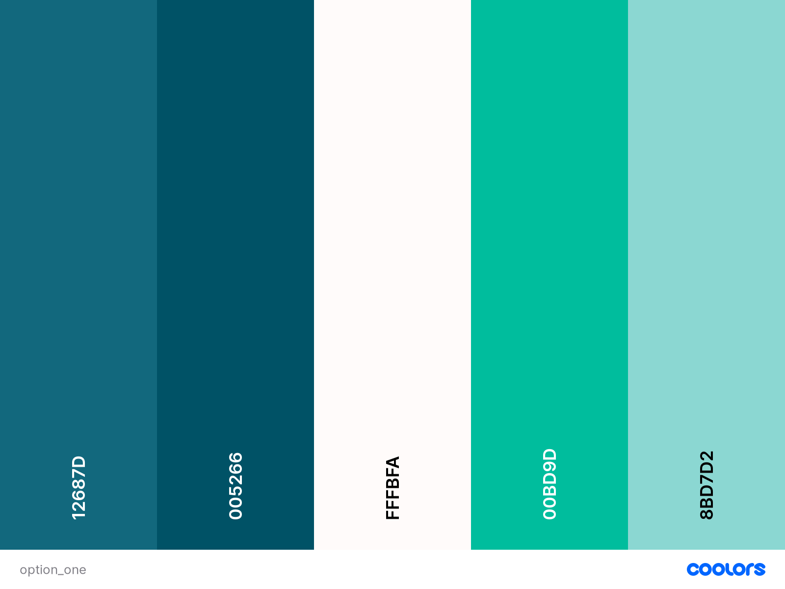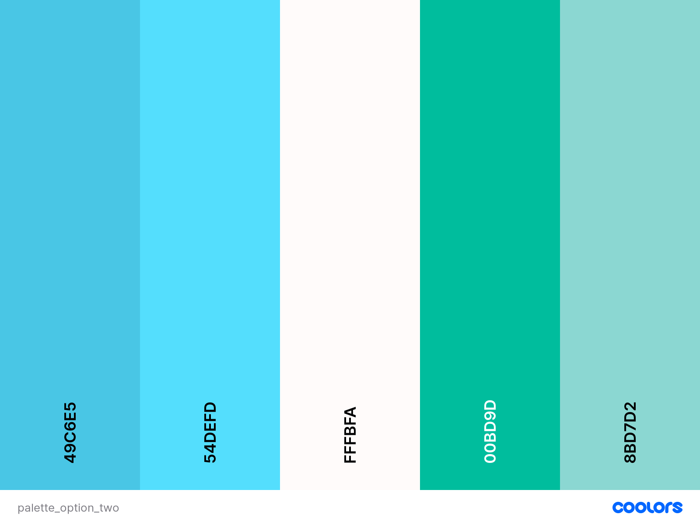

As regards to typography, the IBM Plex Serif font-family was chosen for headings, and the yantramanav font-family for the body; both of which were taken from 
[google fonts](https://fonts.google.com/). Font awesome icons will also be used where suitable.

## Existing implemented features

### Features and content common to all pages

#### Typography:
For typography the font famillies used differ from those mentioned in the design process. On all pages the font family Barlow Semi Condensed was used mainly for headings and the navigation links, and the font family News cycle in the main body elsewhere. The change in fonts was partly stylistic upon receiving user feedback during testing, and also to improve contrast. Again both fonts were sourced from google fonts. 

#### Color scheme:
There are also some slight changes to the color scheme introduced in the design process, again for similar reasons, but more so this time for the purpose of improved text and background color contrast, particulary in the navigation links, footer and logo sections. In all pages the background color of the navigation section, footer and logo container are the same, and a white font is used to maximise contrast. Where borders are present the same color is always used. Likewise any icons used and link underlines use the same color as used for the border. For tables the same background color as for the footer etc is used, and the table lines use the border color. Finally the form outlines use the same color as the borders. In the main section of each page a black font on white background is used always, again to maximise contrast and readability. The use of two background color - line color pairs, accompanied by a fixed font color, that is a function of the background color used, helps to maintain the simplicity and consistency of the site, as well as  generate a sense of famillarity in the user, who can gain information from the repeating pattern of color usage. Additionally the color scheme employed enables the text content to be clear to all users.

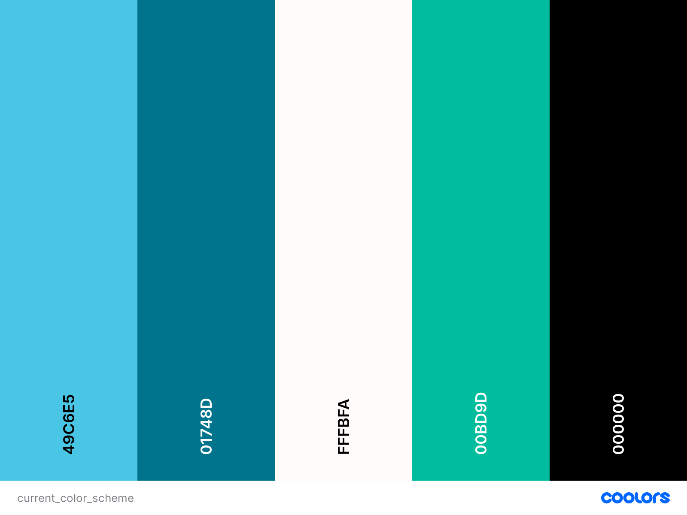

#### Header
The header on all pages consists of a background image for smaller screens and a background image that displays better on larger screens. In the foreground there is a logo container box enclosing the tutor U logo, which is made using in part a font awesome magnet icon, reflecting the STEM theme of the site. The logo is partially transparent to allow the background image to still be seen. Upon page loading the logo and logo container perform an animation expanding and contracting with a transient border color change; the purpose of the animation being to highlight the scheme name and provide visual stimulation to the user. The background images themselves, the first showing a whiteboard with some maths written on it, indicates the site is STEM and teaching related; the second showing a secondary school aged student taking notes whilst looking at a computer, suggests to the user the site is online learning related. Thus either image when used in conjunction with the logo help to indicate the purpose of the site, which is important considering the header is one of the first things a user sees and looks to for information about a site. I did not opt for a sticky header element, due to its size and the fact that it would reduce the amount of content in the main body viewable by the user without scrolling. Generally in content dense sites it is better for the user to be able to see as much content at once for easier readability, rather than having to scroll more than is tolerable.

#### Navigation element
Below the header on each page is a set of main navigation links to every page, ordered from left to right and row by row (narrower displays) in priority of importance and frequency of use when visiting the site. Thus after the landing page, the tutor timetable and then the book a session links are next, as these will be the most commonly used pages by users, who will most commonly be students who must visit the site and those pages everytime to book a session. After these links is the apply to be a tutor link, which will only need to be visited once by each applying tutor. The remaining faq and find out more links are least important and will likely be only accessed a few times by a new user. Feedback to a user informing them of which page they are currently on is indicated using a change in background color and font color around the active page link, which is also underlined. Below are screenshots of the navigation element on different width devices (left: phone size; right: laptop size).

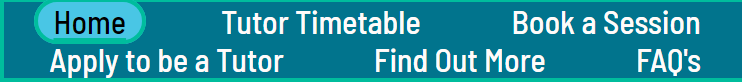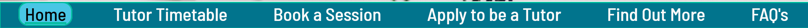

#### Footer
The footer differs from its initial planned design: rather than four separate flex item sections, there are three, with the useful links and contact us sections combined. This was done in order to give each section more width and reduce the degree of horizontal congestion, particularly for smaller screen sizes where wrapping would occur more readily in an untidy manner. 

The site map section first contains a back to top link, supplemented with a suggestive arrow icon; this provides the user with a way to quickly reach content at the top of the page once again without scrolling. Below that are links to all the pages, to allow  the user to change pages without having to scroll back up to the navigation element. Adjacent to the site map, is the contact us section which provides the user with the email and phone number to be used to contact the organisation about the scheme. Beneath the contact us section is the useful links section containing at the moment only a link to the national careers service website for STEM careers. Such information will be of interest to students intrested in finding more out about a possible career in STEM. In the future more external links to useful resources and other information shall be inserted. Finally adjacent to these sections is the follow us section, containing the social media icon links, which take the user to  various social media sites where they can keep up to date with changes to the scheme and other related information pertaining to the organisation.

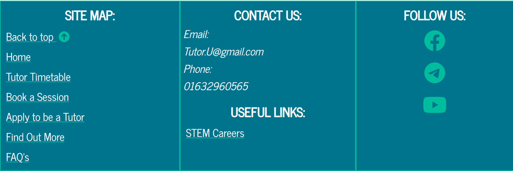

### Home page features and content
The landing page or home page with its 4x4 main element grid layout, has four sections. The top left section is the Our Scheme section, which provides a summary of the important scheme features of interest to both tutors and students. The heading like all others on the page is surrounded by a green border and is bold to clearly indicate each sections content. Font awesome icons are also used to catch the users eye, and make the headings more visually appealing. Below the text in this section there is a page down arrow link, to in part act as a visual hint to a user, if they cannot see (smaller devices), that there is further content of importance below; it also allows them to scroll to the next content sections quickly.

In the adjacent section is the hero-image for the page, that shows a tutor in front of a camera and laptop, tutoring in maths. This image is designed to give a clear impression to both tutors and tutees of how a typical session may operate. The bottom two sections are clearly headed so as to make it clear to who the content is relevant. In each section the use of an unordered list is intended to deliver concisely and precisely the key information and steps a tutor or tutee needs to take to become a tutor or book a session, as well as a step by step description of the whole process. To ths end both sections contain visible descriptive links to one of the form pages.

### Tutor Timetable page features and content
This page is essential in providing students wishing to book a session with a tutor, the best chances of doing so. Filling out the booking form without consulting this table, will lead to students trying to book sessions on days at times when few or zero tutors are available, leading to an unsuccessful wasted attempt.
The page has the biggest deviation from the wireframes produced during the initial design process. I came to the realisation that a single table containing all the information whilst possible, was more complicated to read, and not accessible to screen readers who would need to able to interpret a color key, as well as those with any form of color blindness. Consequently I decided to create a pair of tables for each subject split by days into a monday to friday and saturday table. The use of two tables was to avoid a scrolling table for all but the smallest devices. In the event of the need of a horizontally scrollable table, the first times column was made to be sticky and have a larger z-index so as to slide over the other columns and remain visible with scrolling; thus allowing the number of tutors for each day and time to still be easily read. The screenshots below show a typical pair of subject tables, and the sticky times column in action.

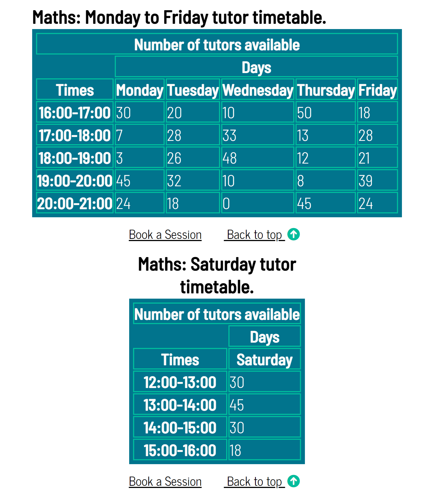 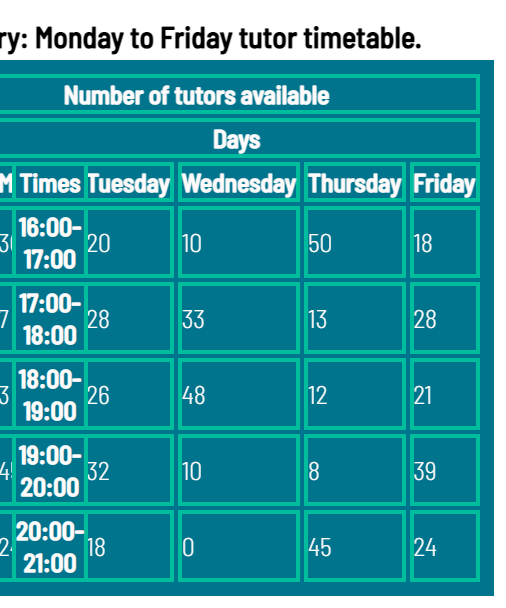

Beneath each table are also two links, one allowing the user to return to the top of the page where another set of links exist for each subjects tables. The other link directs the student user to the booking form page, which is the next appropriate step having consulted the appropriate tutor timetable.

At the top of the page above all tables is a heading and a paragraph providing the student user with information regarding the accuracy of the tables and how often they are updated. Then is the set of links to each pair of timetables for each subject allowing the user to go straight to the timetable they want to see. These links combined with the links beneath each table allow the user to essentially avoid vertical scrolling altogether, and so make navigation between different tables and pages efficient and logical. A final point to note, is at the moment the timetable will have to be manually updated by modifying the HTML.

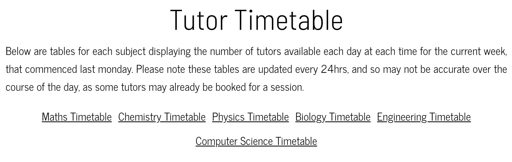

### Form pages features and content
The tutor application and book a session form page facilitate the key functionality of the scheme, as they are the means by which a new tutor can apply to join, and a student can arrange a session. For a student user, the book a session form alongside the tutor timetable page will be the most frequently used pages. Both forms provide sections for the user to provide the necessary contact information required for arranging a session, which will largely be communicated through email. Both forms also contain a subject related and description section: for the tutor application form, tutors can check any number of subjects to tutor in, and then must describe their expertise in each, thus ensuring the tutors are sufficiently qualified; for the book a session form students must pick one subject to receive help in, and then must specify the exact topic or problem they want to discuss. The final section in both forms is identical, allowing users to specify a range of times on as many days as they wish to tutor or potentially be tutored on (with earliest slot with an available tutor being booked).

The required sections/inputs in both forms are designated clearly through the use of text or the commonly used asterisks. Depending on the browser, submitting before all required inputs are filled, focuses the incomplete inputs. Both forms have an evident submit and reset button. Feedback on submission (which is purely illustrative at the moment using the GET method, as no actual data is collected) is given by a form response page which as its content has a 'submission sucessful' heading followed by a ticked checkbox; the user can then use the home button directly below to return to the home page.  A further final feature the book a session form page has, is a reminder to the user to visit the tutor timetable before completing the form, and a link is provided to the timetable page to encourage this.

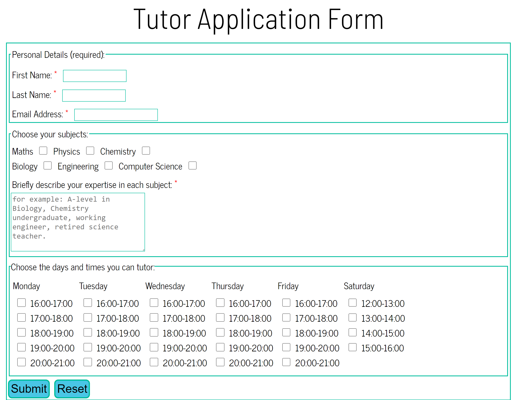 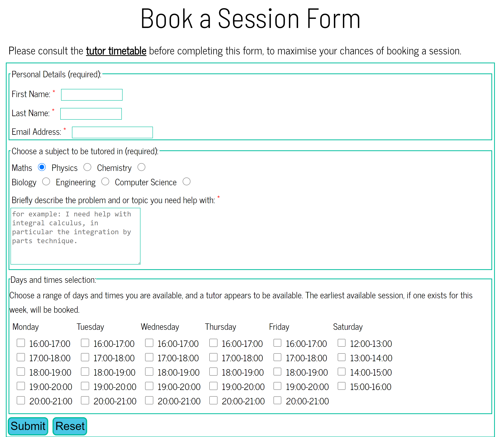

### Find out more page features and content
The find out more page was orginally titled as 'more information', however after using the lighthouse tool, it was apparent that as a title of a navigation link it was not a sufficiently descriptive for the purpose of SEO, whereas 'find out more' is more indicative of the purpose of the content linked. 
This page whilst relatively less important and being less frequently used, by student users at least, provides more in depth information about how the scheme operates in regard to how sessions work, who are and why to be a tutor, as well as who the organisation are. Each of these topics are contained in their own clearly headed sections, allowing the user to pick and choose which extra information may be of interest. Some of the sections also contain links to other pages to enable them to complete the next steps to participate if they have aquired the extra information they wanted before commiting to apply/book. Likewise many users may access this page having already completed the next step, looking for more information to fill in any gaps in their understanding of the scheme.

The only other significant feature present on the page is the hero-image, which similar to one of the background images already discussed features a secondary school student taking notes in front of a computer. This image is intended to further reinforce the desired view of how a session may look, as well as to break up the text content, and make the page less daunting with regard to being text heavy.

### FAQ page features and content
The least important page of all in terms of essential content, is still useful in providing answers to common questions, and also instructs the user to email any further questions not covered, which themselves if they become frequent enough, may be added to the list of questions and answers displayed. The questions are broken in to two demarcated sets, intended for each cateogory of users. The answers are revealed/hidden at a users discretion by using the toggles, thus allowing them to see all questions at once, and only see the answers to the questions they care about. Some of the questions reinforce/summarise content covered elsewhere, whilst others are independent. Additionally some of the answers to the questions contain links to direct the user to certain pages, when relevant to the subject of the question.

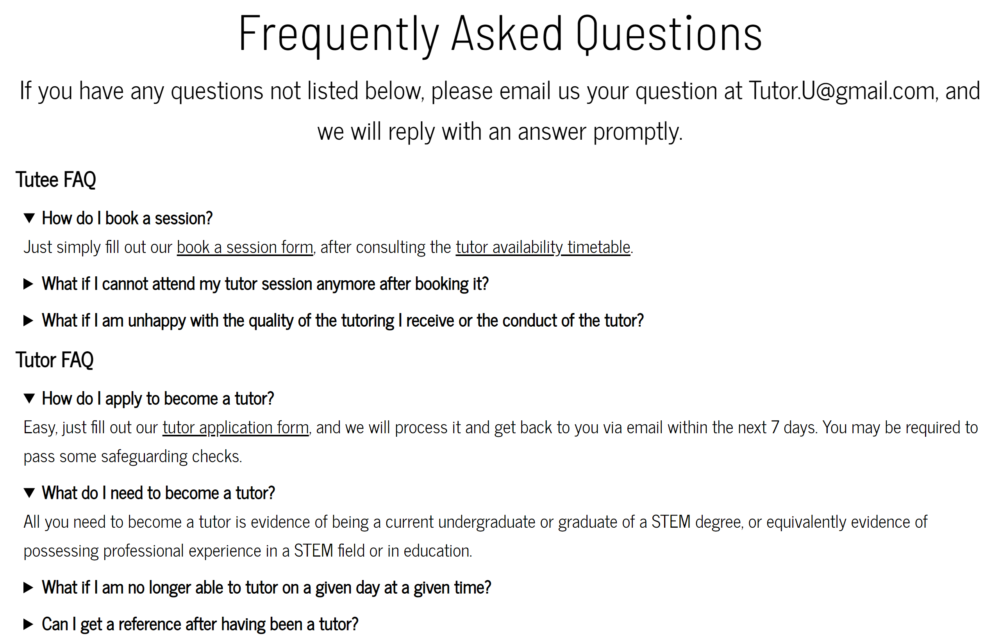

## Proposed future features
- Allow automation of session booking, and real-time updates to tutor availability, to be done using JavaScript or python which I will learn in the near future. At the moment changes to the site need to be done manually, which is inefficient and error-prone, and requires a person with sufficient HTML knowledge; session booking requires the use of emails to be sent manually. Automation will increase functionality of the site, and also make it more scalable.
- Allow tutees to provide feedback/reviews directly to the site. This will help the organisation improve the scheme, and will also be valuable to future tutors and tutees, who can use such reviews to better understand the scheme.
- Allow allocation priority to be assigned that gives preference to those that have received fewer sessions, by tracking how many sessions in a given time period a student has had. At the moment it is likely demand will outweigh supply, and  the organisation wants to provide tutoring sessions to as many of those who can benefit, even if just from a single session.

## Testing process
The testing process performed on the site can be found in [TESTING.md](TESTING.md).

## Deployment

The Tutor U site was deployed on the hosting platform GitHub pages, using the following procedure:

1. In the GitHub project repository, click on the settings tab near the top of the page.
2. On the lefthand menu, in the section designated code and automation, click on the pages link.
3. This brings up the GitHub pages section. In this section move down to the source subsection. In here using the drop down menu select the main branch of the project and click save.
4. A message is then displayed indicating a successful deployment, and a live URL link for the site is displayed.

The live URL link of the Tutor U site is as follows: [Tutor U website](https://matthewbayfield.github.io/tutor-u/index.html)

## Credits

### Media 
All images were sourced from [Pexels](https://www.pexels.com/).

### Content
- All icons used were sourced from [font awesome](https://fontawesome.com/).
- All fonts used were sourced from [google fonts](https://fonts.google.com/).
- All text content was written by myself.
- The color palette was generated using the [coolers palette generator](https://coolors.co/)

### Tools
- Firefox and chrome browser developer tools
- Lighthouse browser extension
- ARC toolkit browser extension
- WAVE evaluation tool browser extension
- WCAG color contrast checker
- w3 HTML validator
- w3 CSS validator
- NVDA screen reader

### Other
- A thank you to the test users for the feedback you provided.
- Thanks to my Code Institute Mentor Richard Wells, for the guidance you provided throughout the project.

