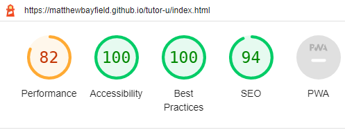
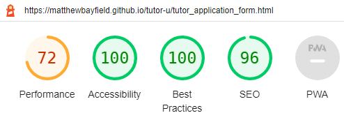
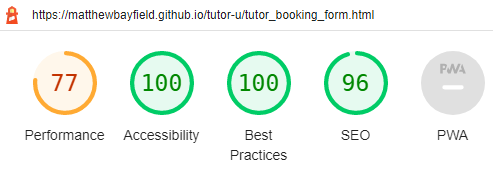
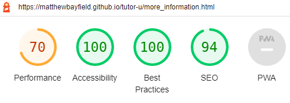
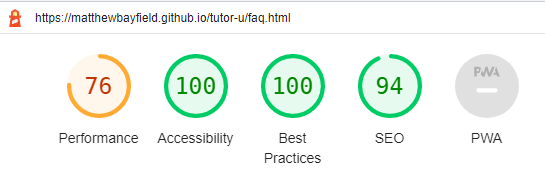
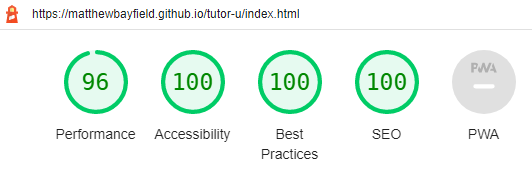

# Testing
Testing was performed throughout the development of the site, including after every feature was added and again after large cumulative changes were made. The form the testing took varied and involved several different tools.

## Manual testing
This was the most commonly performed testing I performed. Each time a feature was added I would check the browser rendered page on a few different browsers, whilst also using the developer tools to check that the elements and their stlying were as they should be. I would also use the responsivity modes of the devtools to check how a given feature or entire page would behave under different aspect ratios and screen sizes. I have tried the site on mobile, tablet, laptop and desktop devices of differing sizes. And for each device cateogory I have tried the most commonly used browsers; namely  Mozilla Firefox, chrome, samsung internet, safari, microsoft edge, opera and brave. I have also tested throughout that all interactive elements such as internal and external links function. For the form pages, I have tested filling out the forms as well as checking the functionality of the reset and submit buttons and the form submission response page. I further tested that submission could not occur without completing the required fields, and that the email input validation works as it should. For the FAQ page I have ensured the toggles work as expected. I have also inspected the sticky times column feature in the event of a scrolling table, and I have ensured images load correctly and and remain unstretched or distorted, as well as that the logo animation works. Finally I have by disabling JavaScript using the devtools tested the no script element present in the tutor u logo.

### Manual testing detected issues
To illustrate how manual testing was used to discover any issues and fix them where possible, I will list a few examples:
- A media query was being used for the landing page to adjust the size ratio of each grid row, in order to remove a large space between the footer and the end of the bottom row content that would appear on wider screens. When changing the row sizes, which initially had the ratio 1fr:1fr, percentage units and fraction (fr) units were mixed giving 60%:1fr which led to the second row content for certain widths overflowing its intended space as was observed in the browser. This was resolved by changing the percentage units to a desired fr equivalant namely the ratio 6fr:4fr.
- It was noticed in the browser devtools and on mobile devices that the header was causing horizontal overflow and thus horizontal scroll despite having a width of 100vw. I then learnt that the viewport units do not take into account the space occupied by the vertical scroll bar. The issue was resolved by changing the width value to 100% which takes into account the actual available space.
- After having changed the file name of the now called tutor_booking_form file I forgot to change the href's of links to the page. By testing one of the links I realised all such links were broken, so I checked the source code and then my mistake was obvious. To fix the issue I merely adjusted the href's.
- It was discovered that the behaviour of the feedback for unfilled or incorrectly filled form inputs varied depending on the browser. In particular for firefox on mobile, there was no obvious feedback which informed the user that any required fields had been not been filled or filled incorrectly. This is obviously a feature of the browser, and will have to be combated with my own coded feedback that resembles the feedback given by other browsers, for example scrolling the page up to the unfilled inputs and giving them focus if not an error message. I will be able to do this once I have learnt JavaScript.
- Again when viewing the site on different browsers on tablet devices, the green checkbox hex symbol in the submission form page did not always display fully correctly. I have yet to discover why this is the case, but may in the future seek an alternative, perhaps, font awesome icon to replace it, which will hopefully resolve the issue.

## User testing
Like with the manual testing conducted by myself, test users of the site were used throughout its development. Their role primarily was to spot any obvious mistakes or visual anomalies, as well give their feedback with regard to their overall user experience: how easy was the site to navigate; how clearly was the information organised, is the text readable, and the color contrast sufficient. Users would also provide feedback on whether the interactive components, namely all links and the form inputs and buttons etc operated as they would expect as a user.

### User testing issues raised
- One tester commented that the initial choice of fonts made the site look dated, unprofessional and untrustworthy. A different tester also was not keen on the fonts. As such the fonts used were changed.
- A tester commented that the contrast between the main body text and the background color at the time could be better, the same applied to the choice of logo color font and background color. This complaint was resolved by changing the background color of the main body, and the color font of the logo.
- A tester discovered a broken link in the site map link section. This was resolved by correcting the link href.
- A test user commented that the social media link icons were to small on a mobile device to see and also tap easily. As such the icon size and spacing between icons was increased.

## Use of HTML and CSS validators 
Every page on the current site passes the [w3 HTML validator](https://validator.w3.org/nu/) with no errors or warnings.

### Issues detected by the HTML validator
- one of the classes for setting the location of each section in the home page grid layout, was missing underscores for spaces. This was fixed by inserting them.
- There was a mismatch of label for and input id attribute values, which was fixed by making them match.
- Some of the section tags were misspelt and were thus corrected.
- A heading element size had sometimes be skipped on some pages, which was fixed by changing the heading types.
- A section had a heading element just before it rather than inside it, and so had to be moved.
- The home button of the form response page used the actual form element button, which is not its purpose. Instead a type of button that is essentially a button styled link was used as was the actual intention. 

Every page on the current site passes the [w3 CSS validator](https://jigsaw.w3.org/css-validator/).

- The only issues detected were some font family value syntax errors, and some duplicated css rules.

## Lighthouse extension tool scores

### For Mobile

#### Home page

To achieve this score, the SEO was improved by using more descriptive links achieved by renaming the more information page to find out more. To improve the performance the hero-image  intrinsic width and height were added to prevent large layout shifts. 
With regard to the performance score, some of the remaining main issues according to the analysis by the tool were a too short cache time for the images; a long main-thread work. I do not know how to configure the github pages  server HTTP response header to change the cache policy. The long main-thread work is likely a consequence of th CSS animation and complex header image and logo, which are important feaures of the site. I do not know how else to minimise the main-thread work effectively. The only remaining issue with the SEO score is that not all the tap links are appropriately sized. However user testing reported no problems with tapping targets, and so for now this has been disregarded.

#### Tutor Timetable page

Again the SEO score is less than 100 because of inappropriately sized tap targets, essentially in the nav element. And also like with the home page performance the main thread work is too large, and worse than the home page score. In this case I suspect it is because of the sheer number of tables and their styling which cannot largely be avoided.

#### Form pages 
 

Both form pages have an almost identical set of scores. Once again the SEO is limited by the nav element tap target size. Also again the main factors limiting the performance score are the background image cache policy, and the main-thread work.

#### Find out more page

For SEO the same aforementioned point applies to this page. Likewise for the performance score. However one extra factor limiting the performance score is that I have not set the intrinsic width or height for the hero-image. This is a conscious choice as setting these image attributes drastically alters the layout, by reserving the full image size space aorund the scaled image, thus causing undesirable layout shifts. The only way to avoid this would be to find a different image more closely matched to each device size.

#### FAQ page

Again the same points common to all pages are behind the SEO and performance scores.

### For desktop

All pages essentially achieved the same set of scores, with all performance scores greater than 96. The cache policy and long main thread work being the main issues stil, all be it far less significant on desktop devices.

## Accessibility
A range of tools were used to test and improve the accessibility of the site. Firstly the WCAG contrast checker was used to assess which contrast standard the site met. Currently all pages meet at least the AA level, including for all types of simulated color blindness. To reach the AAA level was deemed to be too detrimental to the style of the site, making it far less appealing to the user. To achieve this AA level, the active page styling font color had to be changed to black.

Another tool used was the ARC toolkit browser extension along with the web accessibility evaluation tool extension (WAVE). The site currently using these evaluation tools has no errors, and aria attributes have been applied where expected and correctly.

Finally the NVDA screen reader has been used to read through all pages and test how it interacts with all interactive elements. A consequence of using the screen reader was to add an aria label to the tutor u logo heading, as the screen reader does not read any font awesome icons directly. Likewise the uppercase word 'US' was misread as the country, and so aria labels were used to correct this. Another example of a correction made to an issue highlighted by the screen reader, was the replacement of the abbreviation of hours: 'hrs'. A final bug discovered with the screen reader was that when hovering with the mouse over a font-awesome icon associated with a link, the aria labels are not read, at least with NVDA; they are read when the screen reader reads whe whole page in review mode. This seems to be a known issue and I do not know whether the same is true for other screen readers.